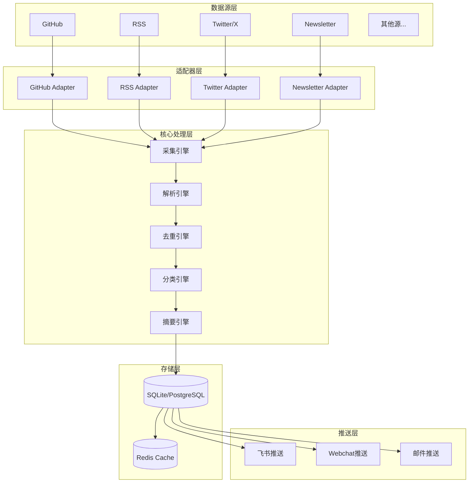
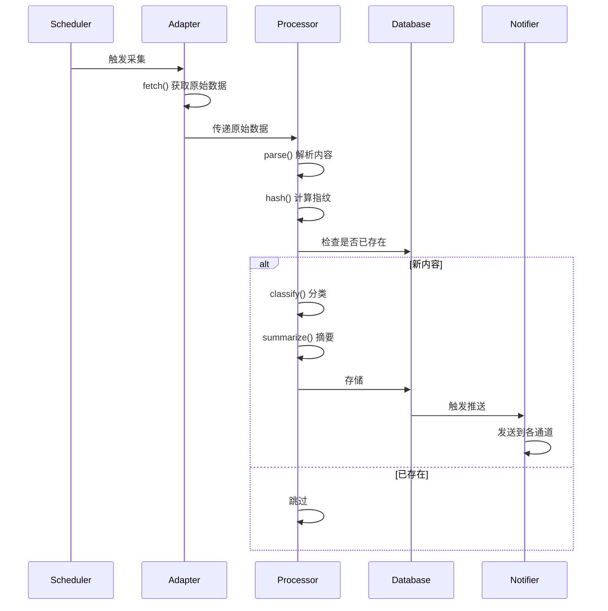
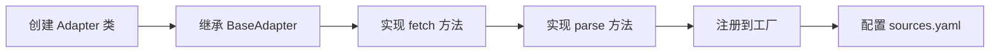
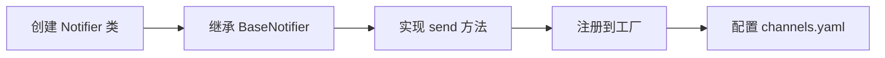
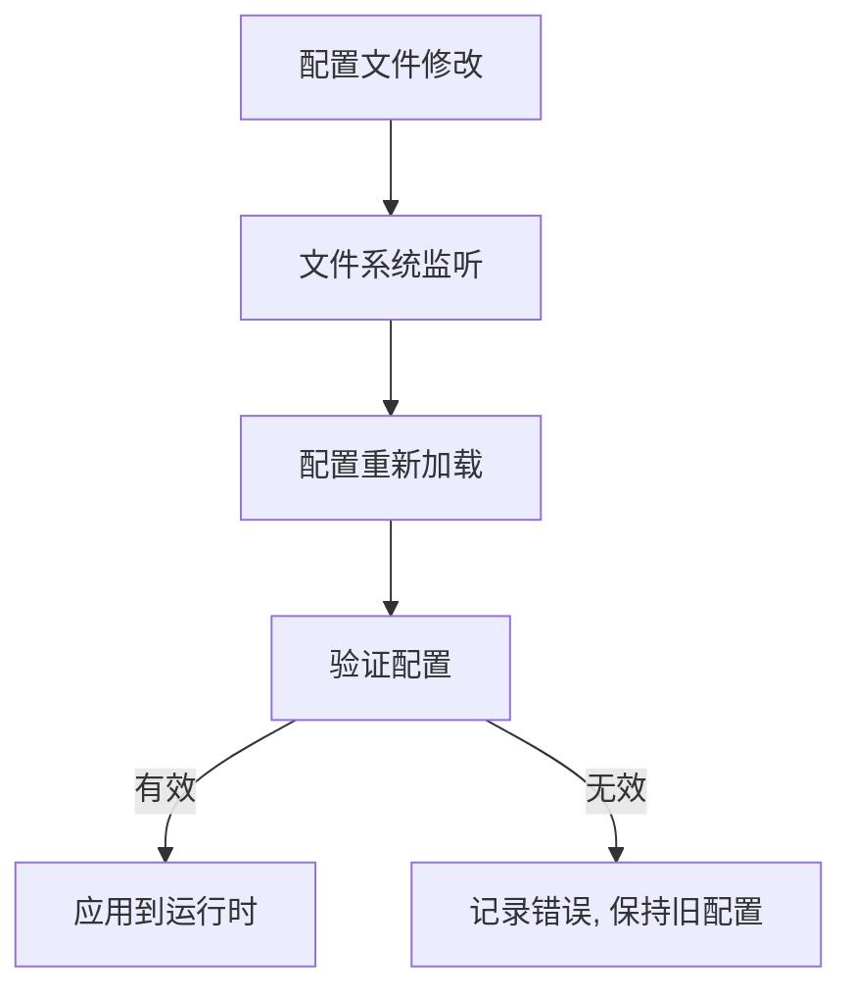
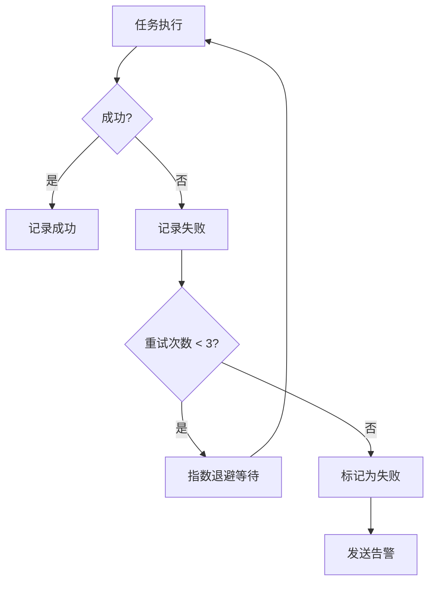

# AI News Hub 架构设计

## 系统架构图



## 数据流



## 模块职责

### 1. 适配器层 (Adapters)

| 适配器 | 职责 | 关键方法 |
|--------|------|---------|
| BaseAdapter | 定义接口规范 | `fetch()`, `parse()` |
| GitHubAdapter | 监控 GitHub 仓库更新 | 读取 commits, releases, issues |
| RSSAdapter | 订阅 RSS 源 | 解析 XML, 提取文章 |
| TwitterAdapter | 监控 Twitter 账号 | API 调用, 推文抓取 |
| NewsletterAdapter | 邮件订阅处理 | IMAP 读取, 内容解析 |

### 2. 核心处理层 (Core)

| 模块 | 职责 | 算法/技术 |
|------|------|----------|
| ConfigManager | 配置管理 | YAML 解析, 热更新 |
| Database | 数据持久化 | SQLite/PostgreSQL |
| DedupEngine | 去重检测 | SimHash, 内容指纹 |
| Classifier | 自动分类 | 关键词匹配, LLM 分类 |
| Summarizer | 内容摘要 | LLM 摘要, 提取关键句 |

### 3. 推送层 (Notifiers)

| 推送器 | 职责 | 格式 |
|--------|------|------|
| FeishuNotifier | 飞书消息推送 | Markdown/卡片 |
| WebchatNotifier | Webchat 推送 | Markdown |
| EmailNotifier | 邮件推送 | HTML/纯文本 |

## 扩展点设计

### 添加新数据源



### 添加新推送通道



## 数据库设计

### 表结构

```sql
-- 新闻内容表
CREATE TABLE news_items (
    id TEXT PRIMARY KEY,
    title TEXT NOT NULL,
    content TEXT,
    summary TEXT,
    url TEXT UNIQUE NOT NULL,
    source_id TEXT NOT NULL,
    source_type TEXT NOT NULL,
    categories TEXT, -- JSON array
    content_hash TEXT UNIQUE NOT NULL,
    published_at TIMESTAMP,
    fetched_at TIMESTAMP DEFAULT CURRENT_TIMESTAMP,
    is_notified BOOLEAN DEFAULT FALSE,
    notify_channels TEXT -- JSON array
);

-- 数据源表
CREATE TABLE sources (
    id TEXT PRIMARY KEY,
    name TEXT NOT NULL,
    type TEXT NOT NULL,
    url TEXT NOT NULL,
    config TEXT, -- JSON
    last_check_at TIMESTAMP,
    is_active BOOLEAN DEFAULT TRUE,
    created_at TIMESTAMP DEFAULT CURRENT_TIMESTAMP
);

-- 推送记录表
CREATE TABLE notifications (
    id TEXT PRIMARY KEY,
    news_id TEXT REFERENCES news_items(id),
    channel TEXT NOT NULL,
    status TEXT, -- sent, failed, pending
    sent_at TIMESTAMP,
    error_message TEXT
);

-- 内容指纹表 (用于去重)
CREATE TABLE content_fingerprints (
    hash TEXT PRIMARY KEY,
    news_id TEXT REFERENCES news_items(id),
    created_at TIMESTAMP DEFAULT CURRENT_TIMESTAMP
);
```

## 配置热更新



## 错误处理与重试



## 性能优化

| 优化点 | 策略 |
|--------|------|
| 采集频率 | 自适应频率调整 |
| 去重检测 | Bloom Filter 预过滤 |
| 内容存储 | 压缩存储大文本 |
| 推送队列 | 批量推送, 异步处理 |
| 缓存策略 | Redis 缓存热点数据 |

## 监控指标

| 指标 | 说明 |
|------|------|
| fetch_latency | 采集延迟 |
| parse_success_rate | 解析成功率 |
| dedup_ratio | 去重比例 |
| notify_success_rate | 推送成功率 |
| queue_depth | 待处理队列深度 |
